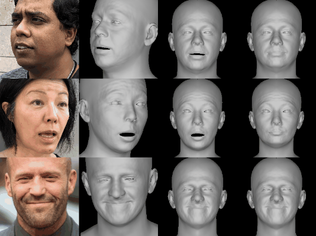

# Adapted-DECA: Adapted Version of Detailed Expression Capture and Animation

<p align="center"> 

</p>
<p align="center">Input image → Reconstruction → Animation with poses & expressions</p>

This repository is an **adapted version** of [DECA](https://github.com/YadiraF/DECA) (SIGGRAPH 2021).  
It keeps the core functionalities of DECA, but has been **modified and fine-tuned** to support new datasets and research use cases (e.g., improved 2D landmark detection, domain-specific adaptation).  

If you are looking for the original DECA, please check the [official repo](https://github.com/YadiraF/DECA).  

---

## Main Features (inherited from DECA)

---

## Getting Started
Clone this repo:
```bash
git clone https://github.com/HoangViet252006/Adapted-DECA.git
cd Adapted-DECA
```

## Inference
```bash
!source activate work38; \
  python demos/demo_reconstruct.py --saveDepth True --saveObj True --useTex True --rasterizer_type=pytorch3d --saveImages True
```